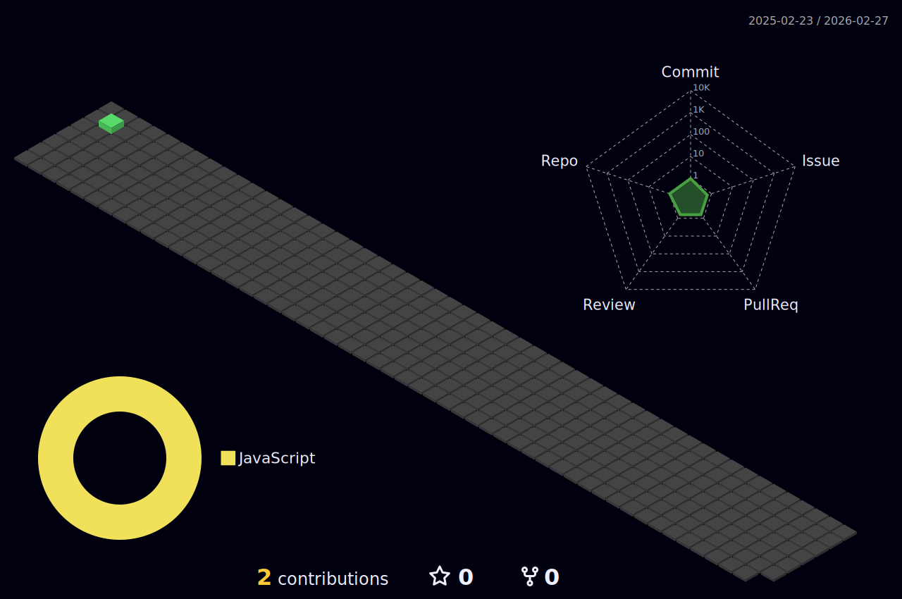

# Seja bem vindo(a)! - Welcome!
<p align="left"> 
   <strong>🙋🏻 Hi, my name is Pedro and I'm a Brazilian currently living in Portugal.</strong><br>
   <p> 
   <strong>📚 I currently study web development with a focus on improving my skills as an SAP Fullstack developer.</strong>
   <p>
</p>
<p align="left">
  <strong>💻 Languages</strong>: HTML, CSS, Javascript, ABAP, SAP UI5.
</p>
<p align="left">
  <strong>🛠️ Tools</strong>: VSCode, SAP ERP, SAP Fiori.
</p>

## Me encontre em - contact me here: 
<div>
   
<a href = "mailto:rpedro.honorato@gmail.com"></a>
<a href="https://www.linkedin.com/in/pedro-honorato" target="_blank"></a>   
</div>

## Estou estudando - I am currently studying:
<p align="left">
  <a href="https://skillicons.dev">
    
  </a>
   
</p>


## Veja minhas métricas - See my stats:

<!--START_SECTION:waka-->

```txt
XML   1 hr 31 mins    █████████████████████████   100.00 %
```

<!--END_SECTION:waka-->

##
<div align="center" style="margin-top: 20px;">
<a href="https://github.com/rp-honorato">


</div>
   
##
<div align="center">

</div>

##
<div align="center" style="margin-top: 20px;">

</div>
