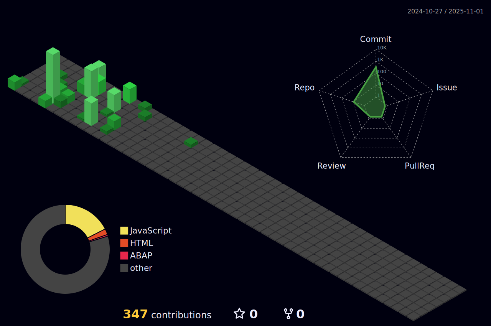

# Seja bem vindo(a)! - Welcome!
<p align="left"> 
   <strong>🙋🏻 Hi, my name is Pedro and I'm a Brazilian currently living in Portugal.</strong><br>
   <p> 
   <strong>📚 I currently study web development with a focus on improving my skills as an SAP Fullstack developer.</strong>
   <p>
</p>
<p align="left">
  <strong>💻 Languages</strong>: HTML, CSS, Javascript, ABAP, SAP UI5.
</p>
<p align="left">
  <strong>🛠️ Tools</strong>: VSCode, SAP ERP, SAP Fiori.
</p>

##Me encontre em - contact me here: 
<div>
<a href = "mailto:rpedro.honorato@gmail.com"></a>
<a href="https://www.linkedin.com/in/pedro-honorato" target="_blank"></a>   
</div>

## Estou estudando - I am currently studying:
[](https://skillicons.dev)

## Veja minhas métricas - See my stats:

<!--START_SECTION:waka-->

```txt
JavaScript   1 hr 53 mins    █████████▓░░░░░░░░░░░░░░░   38.50 %
HTML         1 hr 45 mins    █████████░░░░░░░░░░░░░░░░   35.80 %
CSS          39 mins         ███▒░░░░░░░░░░░░░░░░░░░░░   13.26 %
JSON         21 mins         ██░░░░░░░░░░░░░░░░░░░░░░░   07.35 %
Text         13 mins         █▒░░░░░░░░░░░░░░░░░░░░░░░   04.72 %
```

<!--END_SECTION:waka-->

##
<div align="center" >
<a href="https://github.com/rp-honorato">


</div>
   
##
<div align="center">

</div>


