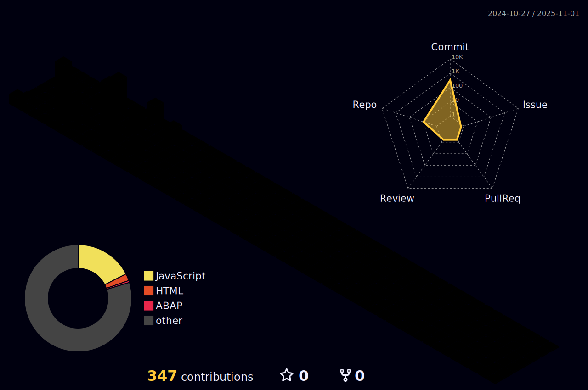

# Welcome!

 
   <strong> Hi, my name is Pedro and I'm a Brazilian currently living in Portugal.</strong>. 
   
 
   <strong>I currently study web development with a focus on improving my skills as an SAP Fullstack developer.</strong>
   

  💻 <strong>Languages</strong>: HTML, CSS, Javascript, ABAP, SAP UI5.

  💼 <strong>Tools</strong>: VSCode, SAP ERP, SAP Fiori.

 📧 <strong>How to contact me?</strong> rpedro.honorato@gmail.com

  
  
  

# I am currently studying:

- ABAP
- Fiori
- SAP UI5
- Javascript

<a href="https://github.com/rp-honorato">

   
